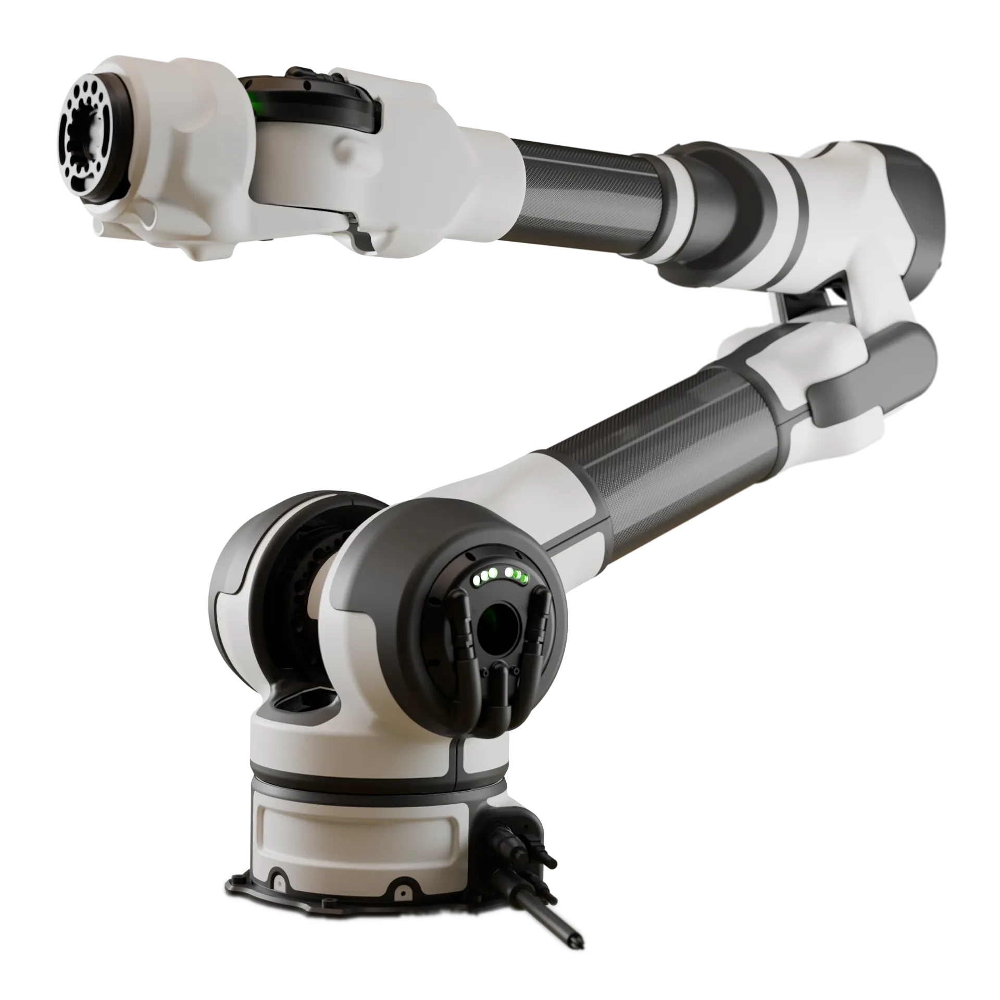

# dynaarm_description

This repository contains the xacro/urdf description file for the [Duatic DynaArms](https://duatic.com/robotic-arm/). The official ROS2 driver can be found in the [dynaarm_driver](https://github.com/Duatic/dynaarm_driver/) repository.
Please see the DynaArm [documentation](https://docs.duatic.com) for more information.

\
Duatic DynaArm v2


# License

The contents are licensed under the BSD-3-Clause  [license](LICENSE).\
Images in this repository are to be licensed separately if you want to use them for any other usecase than forking/cloning this repository for your application. Please open an issue in order to get in touch with us.

# Usage

This package contains only the description files for the DynaArm. The [standalone](./urdf/dynaarm_standalone.urdf.xacro) and [standalone dual](./urdf/dynaarm_standalone_dual.urdf.xacro) demonstrate how to integrate the xacro files into your own description. For simple applications they can also be used directly.


## Supported Arms

This package current supports the following DynaArms:

| Name     | Description |
| ---      | ---         |
| arowana4 | Pre-release version of the arm with 4kg payload at maximum reach |
| baracuda12 | First publicly released version of the  DynaArm with 12kg payload at maximum reach |

## Show case

This repository integrates a simple show case you can view by running

```bash
ros2 launch dynaarm_description view.launch.py covers:=True dual:=True dof:=6 version:=baracuda12
```


Example: baracuda12, no covers, 6 dof

# Contributing

Please see the [Contributing guide](./CONTRIBUTING.md)
